Domestic Surveillance: When And Why Are We Being Watched?
================
Justin Pacholec
December 16, 2016

### Get all surveillance detections within 15 miles of five cities of interest.

#### Cities of interest are listed in protests\_2015.csv, which was hand-coded with information from [this article](https://www.rt.com/usa/327455-protest-police-wages-year/) about protests in 2015. Final graphics can be found in the "graphics" folder.

``` r
feds1.df <- read.csv("data\\feds1.csv")
feds2.df <- read.csv("data\\feds2.csv")
feds3.df <- read.csv("data\\feds3.csv")

#merge the three dataframes into one
feds.df <- rbind(feds1.df, feds2.df, feds3.df)

#clean up unnecessary data frames
rm(feds1.df, feds2.df, feds3.df)

protests.df <- read.csv("data\\protests_2015.csv")

protests.df$longitude <- as.numeric(protests.df$longitude)
protests.df$latitude <- as.numeric(protests.df$latitude)
feds.df$longitude <- as.numeric(feds.df$longitude)
feds.df$latitude <- as.numeric(feds.df$latitude)

#The minimum radius aroud a protest that we are interested in. This is 15 miles in meters.
MAX_RADIUS <- 24140.2

withinDist.mat <- matrix(nrow=dim(feds.df)[1],ncol=dim(protests.df)[2])

#We're about to start cutting up our datframe, so let's add a coloumn for
#the index of the original data frama to keep track of where we are
feds.df$ID<-seq.int(nrow(feds.df))

withinDist.list <- list()

for(indx in 1:5) {
  #Get long and lat of protest
  protestLon <- protests.df[indx,6]
  protestLat <- protests.df[indx,5]
  #Only look at places +/- 1 long or lat points away to speed up distance computation
  reasonableDistanceAway <- feds.df$longitude < (protestLon + 1) &
    feds.df$longitude > (protestLon - 1) &
    feds.df$latitude < (protestLat + 1) &
    feds.df$latitude > (protestLat - 1)
  cutfeds.df <- feds.df[reasonableDistanceAway,]
  # see if this plane's coordinates are within MAX_RADIUS of the protest location
  withinDist <- function(row) {
    distm( c(as.numeric(row[4]), as.numeric(row[3])),c(protestLon,protestLat), fun = distHaversine) < MAX_RADIUS
  }
  #Get a list of the applicable row numbers in feds.df
  withinDist.bool <- apply(cutfeds.df, 1, withinDist)
  withinDist.Indices <- cutfeds.df[withinDist.bool,]$ID
  #Store the applicable row numbers for each unique protest location in a list
  withinDist.list[[indx]] <- withinDist.Indices
}

# No data in Roseburg, OR or Columbia, Mo
# Just create a list for DC, Chicago, and NY in that order
withinDist.list2 <- c(withinDist.list[1],withinDist.list[2],withinDist.list[4])
```

### For those cities with a significant number of surveillance detections, how many were there per day for each city?

``` r
#create a date column to be treated as dates
feds.df$date <-substr(feds.df$timestamp, 1, 10)
feds.df$date <- as.Date(feds.df$date)

#Count the number of lat/long points at specific dates
#start by creating a datframe for the dates
minDate <- min(feds.df$date)
maxDate <- max(feds.df$date)
dates <- seq(minDate, maxDate, by=1)
flightCount.df <- data.frame(date = dates)

#add columns of point counts for DC, Chicago, and NY in flightCount.df
for (indx in 1:length(withinDist.list2)){
  countPointsInDateBin <- function(row) {
    dateCut <- feds.df[withinDist.list2[[indx]],]$date
    sum(dateCut == row[1], na.rm=TRUE) 
  }
  flightCount.df[,1+indx] <- apply(flightCount.df, 1, countPointsInDateBin)
}

names(flightCount.df)[2:4] <- c("DC", "CHI", "NY")

DC.plot <- ggplot(flightCount.df,aes(x=date, y=DC)) +
  geom_bar(stat="identity") +
  xlab("Date") +
  ylab("Count of Flight Data Points") +
  ggtitle("Surveillance Plane Detections Per Day Within 15 Miles of Washington, DC") +
  theme_fivethirtyeight()

CHI.plot <- ggplot(flightCount.df,aes(x=date, y=CHI)) +
  geom_bar(stat="identity") +
  xlab("Date") +
  ylab("Count of Flight Data Points") +
  ggtitle("Chicago, IL") +
  theme_fivethirtyeight()

NY.plot <- ggplot(flightCount.df,aes(x=date, y=NY)) +
  geom_bar(stat="identity") +
  xlab("Date") +
  ylab("Count of Flight Data Points") +
  ggtitle("New York City") +
  theme_fivethirtyeight()

# Arrange in a multiplot
grid.arrange(DC.plot, CHI.plot, NY.plot, heights = c(1,1,1), ncol=1)
```

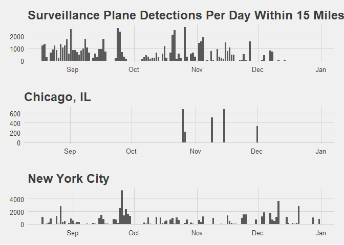

### Create gifs to demonstrate changes in surveillence traffic surrounding dates of interest.

#### December 1, 2015: amidst widespread protest, Chicago's police superintendent is forced to resign.

``` r
# Get list of pre-loaded map data
load("maps.RData")


#Create new feds data frame with only the columns we care about
feds2.df <- feds.df[,c("longitude","latitude","date", "flight_id")]

# Get Chicago location and map
CHI.loc <- c(lon = protests.df$longitude[2], lat = protests.df$latitude[2])
CHI.map <- maplist[[1]]

# 2015-12-1: Chicago's police superintendent was forced to resign
dateOfInterest <- as.Date("2015-12-1")
dateSeq <- seq(dateOfInterest - 1, dateOfInterest + 1, by=1)
fedsCut.df <- feds2.df[feds2.df$date %in% dateSeq,]
CHI.gif <- ggmap(CHI.map) +
  geom_point(aes(x = longitude, y = latitude, color=flight_id, frame=date), data = fedsCut.df) +
  scale_color_discrete(guide=F)+
  theme(axis.title.x=element_blank(),
        axis.text.x=element_blank(),
        axis.ticks.x=element_blank(),
        axis.title.y=element_blank(),
        axis.text.y=element_blank(),
        axis.ticks.y=element_blank())

gganimate(CHI.gif)
```

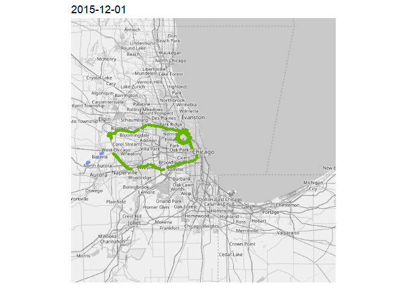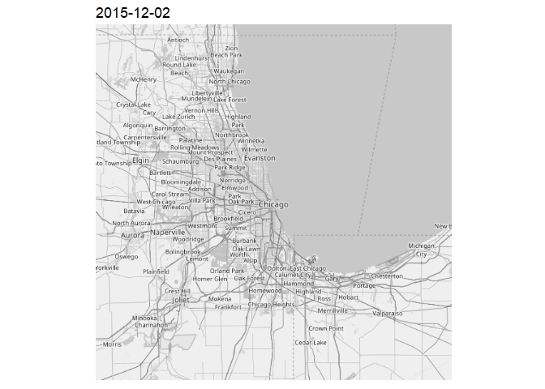

#### October 22, 2015: hundreds gather in New York City's Times Square, launching a three-day protest against police brutality and mass incarceration dubbed 'Rise Up October.'

``` r
# Get New York City location and map
NY.loc <- c(lon = protests.df$longitude[4], lat = protests.df$latitude[4])
NY.map <- maplist[[2]]

#2015-10-22 - 2015-10-24: Rise Up October protests
minDate <- as.Date("2015-10-22")
maxDate <- as.Date("2015-10-24")
dateSeq <- seq(minDate - 1, maxDate, by=1)
fedsCut.df <- feds2.df[feds2.df$date %in% dateSeq,]
NY.gif <- ggmap(NY.map) +
  geom_point(aes(x = longitude, y = latitude, color=flight_id, frame=date), data = fedsCut.df) +
  scale_color_discrete(guide=F)+
  theme(axis.title.x=element_blank(),
        axis.text.x=element_blank(),
        axis.ticks.x=element_blank(),
        axis.title.y=element_blank(),
        axis.text.y=element_blank(),
        axis.ticks.y=element_blank())

gganimate(NY.gif)
```

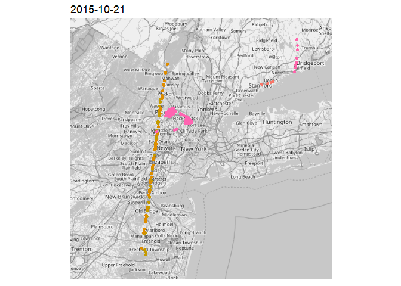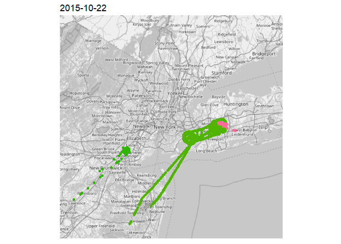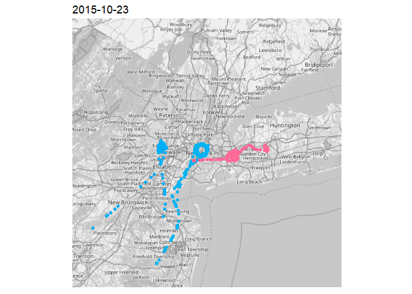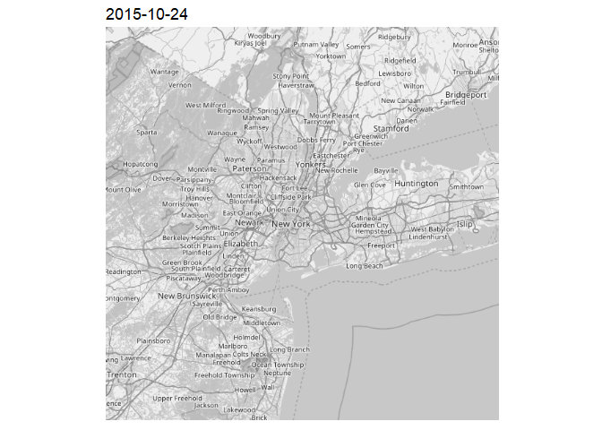

#### September 23, 2015: The Pope visits Washington, DC.

``` r
# Get Washington, DC location and map
DC.loc <- c(lon = protests.df$longitude[1], lat = protests.df$latitude[1])
DC.map <- maplist[[3]]

# 2015-9-23: Pope vists Washington, DC
minDate <- as.Date("2015-9-21")
maxDate <- as.Date("2015-9-28")
dateSeq <- seq(minDate, maxDate, by=1)
fedsCut.df <- feds2.df[feds2.df$date %in% dateSeq,]
DC.gif <- ggmap(DC.map) +
  geom_point(aes(x = longitude, y = latitude, color=flight_id, frame=date), data = fedsCut.df) +
  scale_color_discrete(guide=F)+
  theme(axis.title.x=element_blank(),
        axis.text.x=element_blank(),
        axis.ticks.x=element_blank(),
        axis.title.y=element_blank(),
        axis.text.y=element_blank(),
        axis.ticks.y=element_blank())

gganimate(DC.gif)
```

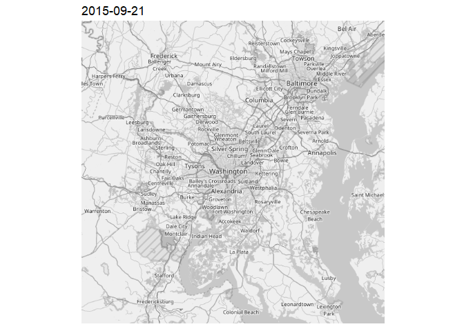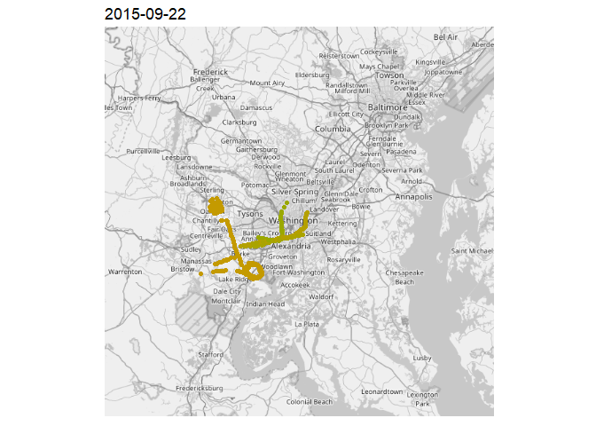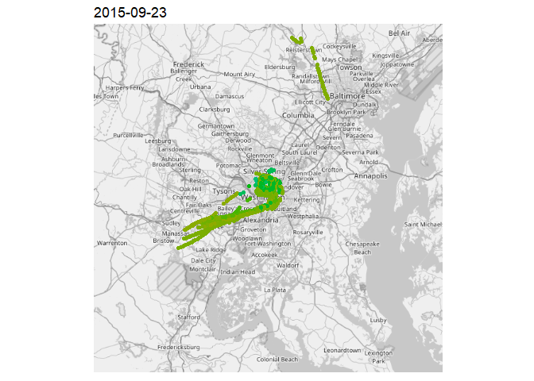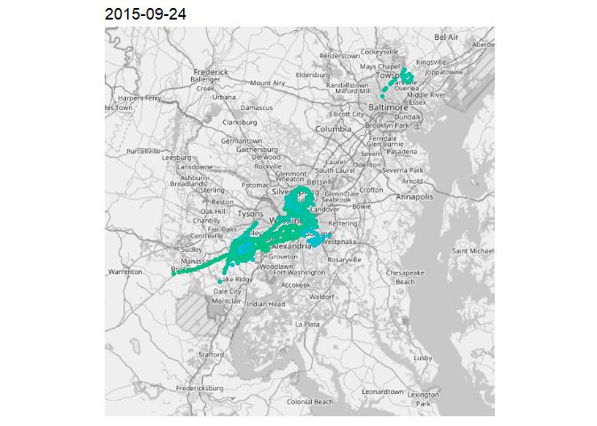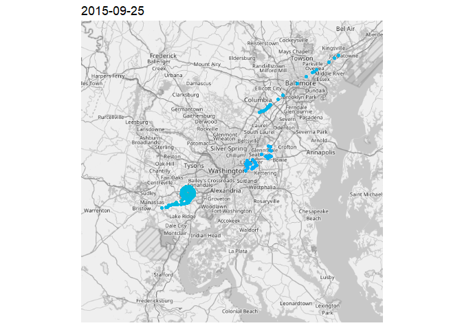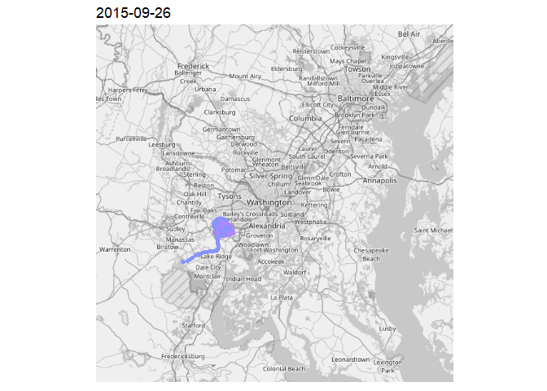
